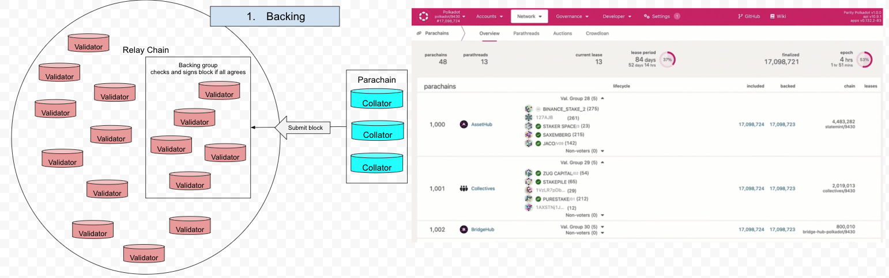
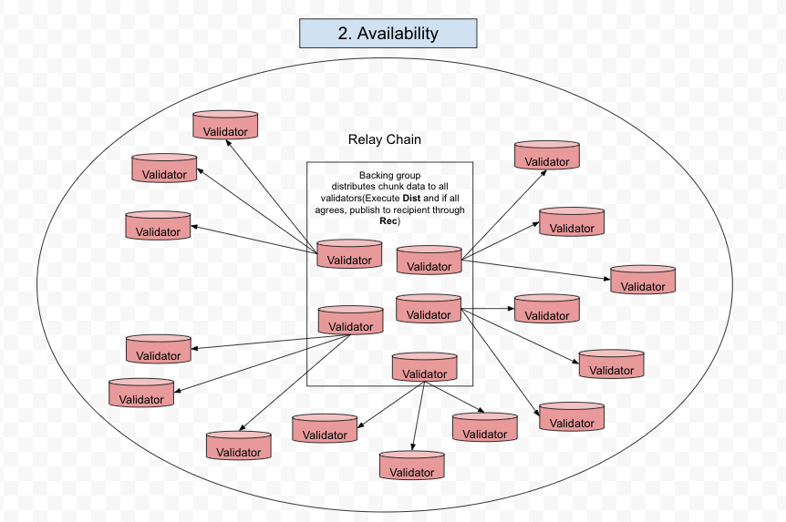
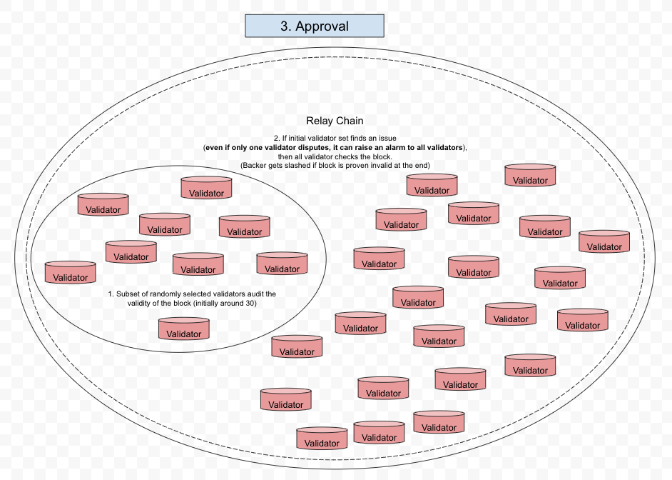

# ELVES

ELEVES (endorsing light validity evaluator system) is the block auditing layer on Polkadot.
It is the security layer that ensures the block validity and punishes the bad actors (i.e. malicious validator) during the process.

### Reference
[elves_paper](https://eprint.iacr.org/2024/961.pdf)

## Bcking

## Availability

## Approval

